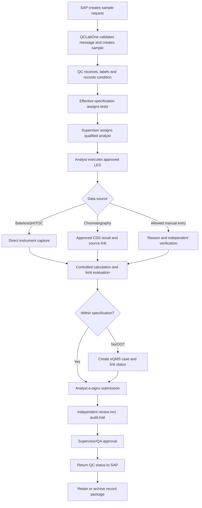

# QCLabOne 2.0 Business Process Description

> **Use notice:** This Markdown file is a fully populated fictional CSV training case. It is not an executed GMP record and does not replace company procedures, approved signatures, supplier evidence, or site-specific risk decisions.

## Document control

| Field | Value |
|---|---|
| Document number | QCL-2026-BPD-001 |
| Company | NovaSterile Pharma Co., Ltd. |
| Site | Suzhou Sterile Products Manufacturing Site |
| Project | QCLabOne 2.0 QC Laboratory Digital Platform Replacement Project |
| System | QCLabOne 2.0 LIMS/LES |
| Lifecycle phase | Project Initiation |
| Version | 1.0 |
| Effective/record date | 2026-02-20 |
| Case status | Approved in fictional case |

## Governing references

- China GMP (2010 Revision), Appendix: Computerised Systems (effective 1 December 2015)
- China GMP (2010 Revision), Appendix: Qualification and Validation (effective 1 December 2015)
- EU GMP Annex 11: Computerised Systems (2011)
- EU GMP Annex 15: Qualification and Validation (2015)
- 21 CFR Part 11: Electronic Records; Electronic Signatures
- FDA Guidance: Part 11, Electronic Records; Electronic Signatures — Scope and Application
- PIC/S PI 041-1: Good Practices for Data Management and Integrity in Regulated GMP/GDP Environments (2021)
- ISPE GAMP 5, Second Edition (2022), used as non-binding industry guidance

## 1. Purpose

This document describes the current and future QC process and identifies the business/data control points used in requirements, risk assessment, configuration and testing.

## 2. Current state

Legacy LIMS 6.2 manages sample login and selected results; CDS/SDMS stores chromatographic source data; spreadsheets track stability pulls and selected inventories; paper worksheets support wet-chemistry execution. Reviewers assemble evidence across repositories, and selected values are manually transcribed.

## 3. Future-state process

## 4. Normal process controls

| Step | Activity | Primary control |
|---|---|---|
| 1 | Receive SAP request | Schema validation, unique message ID, duplicate prevention |
| 2 | Generate sample/barcode | Non-reusable identity and verified print |
| 3 | Receive and custody sample | User/time/location/condition/quantity and exception reason |
| 4 | Assign tests | Only effective approved specification/method |
| 5 | Assign analyst | Role and qualification check; qualification status maintained in LIMS master data |
| 6 | Execute LES | Approved version, mandatory steps, direct capture and audit trail |
| 7 | Calculate/evaluate | Controlled formula, units, rounding and limits |
| 8 | Investigate exception | eQMS case creation, case link and workflow hold |
| 9 | Submit/review/approve | Unique e-signatures, segregation and audit-trail review |
| 10 | Return status/archive | Acknowledged SAP message and retention-controlled record package |

## 5. Exception processes

| Exception | Required flow |
|---|---|
| Sample rejected/damaged | Record condition and reason; notify requestor; cancel/re-sample under approval |
| Interface outage | Use approved contingency form; independent check; reconcile and mark manual entry after restoration |
| Instrument message error | Hold in exception queue; investigate source/unit/context; authorised reprocess only |
| OOS/OOT | Place result/sample on hold; create one eQMS case; retain original data; follow investigation SOP |
| Repeat/retest | Retain original attempt; document authorisation and scientific rationale; no overwriting |
| Post-signature correction | Invalidate affected approval, capture reason/audit trail and re-route review |
| Specification change | Effective-date future use; completed records retain historical version |
| Record retrieval failure | Open incident; use redundant archive copy; assess batch/inspection impact |

## 6. Data-integrity control points

Critical controls include unique identity, contemporaneous timestamps, source metadata, immutable history, reason for change, independent review, electronic-signature binding, exception queues, reconciliation and long-term availability.

## 7. Related documents

| Relationship | Document ID | Document |
|---|---|---|
| Input | QCL-2026-CHA-001 | [QCLabOne 2.0 Project Charter](005_Project_Charter.md) |
| Input | QCL-2026-SCP-001 | [QCLabOne 2.0 Project Scope Statement](006_Project_Scope_Statement.md) |
| Input | QCL-2026-IUS-001 | [QCLabOne 2.0 Intended Use Statement](007_Intended_Use_Statement.md) |
| Output | QCL-2026-PRA-001 | [Preliminary Risk Assessment](011_Preliminary_Risk_Assessment.md) |
| Output | QCL-2026-DIRA-001 | [Data Integrity Risk Assessment](012_Data_Integrity_Risk_Assessment.md) |
| Output | QCL-2026-URS-001 | [User Requirements Specification](022_User_Requirements_Specification.md) |
| Output | QCL-2026-FS-001 | [Functional Specification](023_Functional_Specification.md) |
| Output | QCL-2026-ICS-001 | [Interface Control Specification](027_Interface_Control_Specification.md) |
| Output | QCL-2026-DDS-001 | [Data Flow, Data Dictionary and Metadata Specification](028_Data_Flow_Data_Dictionary_and_Metadata_Specification.md) |
| Output | QCL-2026-PQ-001 | [Performance Qualification and User Acceptance Test Report](050_Performance_Qualification_and_UAT_Report.md) |
| Output | SOP-QC-LIMS-001 | [QCLabOne 2.0 User Operation SOP](066_User_Operation_SOP.md) |

## Approval record

| Approval step | Role | Case outcome |
|---|---|---|
| Prepared by | CSV Project Manager | Completed |
| Reviewed by | QC Business Process Owner | Completed |
| Approved by | Project Sponsor | Approved in fictional case |

## Revision history

| Version | Date | Change |
|---|---|---|
| 1.0 | 2026-02-20 | Initial approved fictional case version. |
