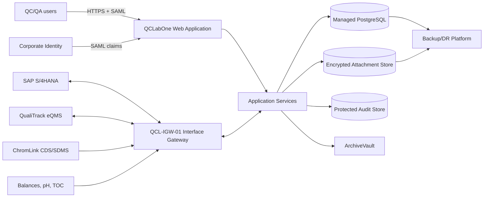

# System Design Specification

> **Use notice:** This Markdown file is a fully populated fictional CSV training case. It is not an executed GMP record and does not replace company procedures, approved signatures, supplier evidence, or site-specific risk decisions.

## Document control

| Field | Value |
|---|---|
| Document number | QCL-2026-DS-001 |
| Company | NovaSterile Pharma Co., Ltd. |
| Site | Suzhou Sterile Products Manufacturing Site |
| Project | QCLabOne 2.0 QC Laboratory Digital Platform Replacement Project |
| System | QCLabOne 2.0 LIMS/LES |
| Lifecycle phase | Design |
| Version | 1.0 |
| Effective/record date | 2026-10-31 |
| Case status | Approved in fictional case |

## Governing references

- China GMP (2010 Revision), Appendix: Computerised Systems (effective 1 December 2015)
- China GMP (2010 Revision), Appendix: Qualification and Validation (effective 1 December 2015)
- EU GMP Annex 11: Computerised Systems (2011)
- EU GMP Annex 15: Qualification and Validation (2015)
- 21 CFR Part 11: Electronic Records; Electronic Signatures
- FDA Guidance: Part 11, Electronic Records; Electronic Signatures — Scope and Application
- PIC/S PI 041-1: Good Practices for Data Management and Integrity in Regulated GMP/GDP Environments (2021)
- ISPE GAMP 5, Second Edition (2022), used as non-binding industry guidance

## 1. Design objectives

The design separates regulated business logic, integration processing, identity, storage and long-term archive. It supports least privilege, immutable history, failure detection, reconciliation and recovery.

## 2. Logical architecture

## 3. Design components

| Component | Design responsibility | Key control |
|---|---|---|
| Web/application tier | Supplier-managed clustered service | Environment/version banner, TLS, health monitoring, controlled deployment |
| Database | Managed PostgreSQL service | Encryption, transaction integrity, point-in-time recovery, restricted administration |
| Attachment store | Encrypted object storage | Versioning, checksum and backup |
| Audit store | Append-only protected service | No routine update/delete; searchable export |
| Interface gateway | On-site hardened virtual server | Protocol transformation, validation, idempotency, queue and reconciliation |
| Identity | Corporate SAML federation | Unique individual identity and approved role claims |
| Archive | ArchiveVault read-only repository | Manifest/checksum validation and long-term retrievability |

## 4. Environment model

Development, supplier test, site validation, training and production environments are logically separated. Production data is not copied to lower environments unless masked and approved. Promotion follows DEV → TEST → VAL → PROD using signed release packages and checksums.

## 5. Data and transaction design

Each business entity has a globally unique identifier and version. State-changing transactions are atomic. Failed interface processing does not create partial business records. Historical specification, method, calculation and role context is stored with or referenced by the regulated record.

## 6. Security design

Authentication is federated; authorization is role-based. Service accounts are non-interactive. Privileged access is just-in-time. Secrets are stored in the approved vault. All external connections use authenticated encrypted protocols. No ordinary role has database or audit-store write access.

## 7. Availability and recovery design

The application runs on redundant nodes. Database replication and 15-minute RPO controls support DR. Gateway queues persist across restart. Monitoring covers availability, backlog, failed messages, certificate expiry, backup and time synchronization.

## 8. Related documents

| Relationship | Document ID | Document |
|---|---|---|
| Input | QCL-2026-URS-001 | [User Requirements Specification](022_User_Requirements_Specification.md) |
| Input | QCL-2026-FS-001 | [Functional Specification](023_Functional_Specification.md) |
| Input | QCL-2026-CYB-001 | [Cybersecurity and Privacy Impact Assessment](014_Cybersecurity_and_Privacy_Impact_Assessment.md) |
| Input | QCL-2026-SDL-001 | [Supplier Documentation Leveraging Assessment](021_Supplier_Documentation_Leveraging_Assessment.md) |
| Output | QCL-2026-CS-001 | [Configuration Specification](025_Configuration_Specification.md) |
| Output | QCL-2026-IAD-001 | [Infrastructure and Architecture Design](026_Infrastructure_and_Architecture_Design.md) |
| Output | QCL-2026-ICS-001 | [Interface Control Specification](027_Interface_Control_Specification.md) |
| Output | QCL-2026-DDS-001 | [Data Flow, Data Dictionary and Metadata Specification](028_Data_Flow_Data_Dictionary_and_Metadata_Specification.md) |
| Output | QCL-2026-BRS-001 | [Backup and Restore Specification](034_Backup_and_Restore_Specification.md) |
| Output | QCL-2026-BCP-001 | [Business Continuity and Disaster Recovery Plan](035_Business_Continuity_and_Disaster_Recovery_Plan.md) |
| Output | QCL-2026-BLD-001 | [Installation, Build and Configuration Record](040_Installation_Build_and_Configuration_Record.md) |
| Output | QCL-2026-CIR-001 | [Configuration Item and Version Register](041_Configuration_Item_and_Version_Register.md) |

## Approval record

| Approval step | Role | Case outcome |
|---|---|---|
| Prepared by | System Owner | Completed |
| Reviewed by | Vendor Solution Architect | Completed |
| Approved by | QA CSV Lead | Approved in fictional case |

## Revision history

| Version | Date | Change |
|---|---|---|
| 1.0 | 2026-10-31 | Initial approved fictional case version. |
