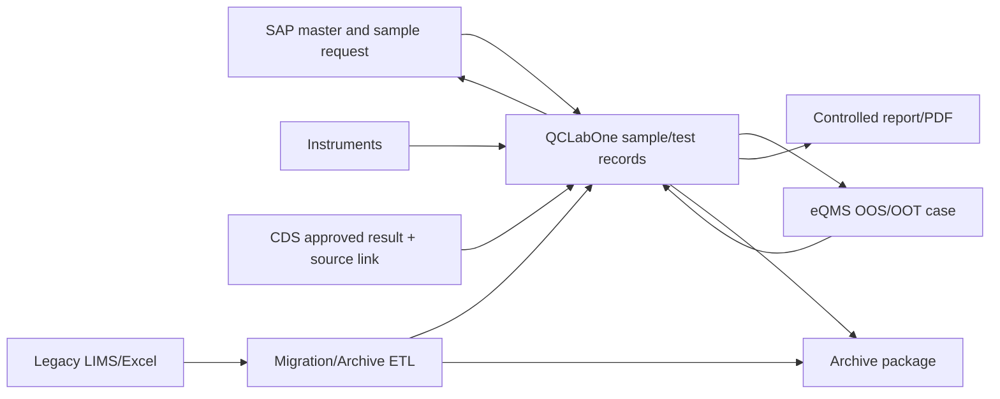

# Data Flow, Data Dictionary and Metadata Specification

> **Use notice:** This Markdown file is a fully populated fictional CSV training case. It is not an executed GMP record and does not replace company procedures, approved signatures, supplier evidence, or site-specific risk decisions.

## Document control

| Field | Value |
|---|---|
| Document number | QCL-2026-DDS-001 |
| Company | NovaSterile Pharma Co., Ltd. |
| Site | Suzhou Sterile Products Manufacturing Site |
| Project | QCLabOne 2.0 QC Laboratory Digital Platform Replacement Project |
| System | QCLabOne 2.0 LIMS/LES |
| Lifecycle phase | Design |
| Version | 1.0 |
| Effective/record date | 2026-10-31 |
| Case status | Approved in fictional case |

## Governing references

- China GMP (2010 Revision), Appendix: Computerised Systems (effective 1 December 2015)
- China GMP (2010 Revision), Appendix: Qualification and Validation (effective 1 December 2015)
- EU GMP Annex 11: Computerised Systems (2011)
- EU GMP Annex 15: Qualification and Validation (2015)
- 21 CFR Part 11: Electronic Records; Electronic Signatures
- FDA Guidance: Part 11, Electronic Records; Electronic Signatures — Scope and Application
- PIC/S PI 041-1: Good Practices for Data Management and Integrity in Regulated GMP/GDP Environments (2021)
- ISPE GAMP 5, Second Edition (2022), used as non-binding industry guidance

## 1. Data-flow model

## 2. Data ownership and lifecycle

Data is created at the authoritative source, validated on entry/transfer, processed under version-controlled rules, reviewed and signed, retained online, archived with metadata/audit trail and eventually disposed only under the approved retention schedule.

## 3. Core data dictionary

| Entity | Field | Type | Rule | Authoritative source |
|---|---|---|---|---|
| Sample | SampleID | String | Unique QCL-YYYY-NNNNNNN; immutable | QCLabOne |
| Sample | SourceRequestID | String | SAP request/correlation ID | SAP |
| Sample | MaterialCode | String | Approved material master code | SAP |
| Sample | BatchNumber | String | Manufacturing batch/lot | SAP |
| Sample | ReceiptTimestamp | Timestamp | System-generated CST display/UTC storage | QCLabOne |
| TestAssignment | TestID | String | Unique test assignment | QCLabOne |
| TestAssignment | SpecificationVersion | String | Effective version linked at assignment | QCLabOne |
| Result | ResultID | String | Unique result record | QCLabOne |
| Result | NumericValue | Decimal | Full precision stored; display rounding by method | QCLabOne/CDS |
| Result | Unit | Controlled code | Method-approved unit | QCLabOne |
| Result | SourceType | Enum | Direct instrument/CDS/manual/calculated | QCLabOne |
| Result | SourceRecordID | String/URL | Device message ID or CDS sequence/link | Source system |
| Calculation | FormulaVersion | String | Approved immutable formula version | QCLabOne |
| Signature | SignerID | String | Unique corporate identity | Identity service |
| Signature | Meaning | Enum | Performed/Reviewed/Approved/Rejected/Cancelled | QCLabOne |
| Signature | SignedAt | Timestamp | System-generated | QCLabOne |
| AuditEvent | OldValue/NewValue | Structured text | Complete changed value/context | QCLabOne |
| AuditEvent | Reason | Controlled + text | Mandatory for critical changes | QCLabOne |
| QualityCase | CaseID | String | Returned eQMS case identifier | eQMS |
| ArchivePackage | ManifestChecksum | SHA-256 | Package integrity | QCLabOne/ArchiveVault |

## 4. Metadata requirements

Every regulated record package preserves unique ID, creator/source, creation and modification time, version, status, related record IDs, signature manifestation, audit trail, attachments, configuration/method references and retention category.

## 5. Data-quality rules

Null mandatory values, invalid codes, unsupported units, broken relationships, duplicate business keys and checksum mismatch are rejected or quarantined. Corrections never overwrite the original history.

## 6. Related documents

| Relationship | Document ID | Document |
|---|---|---|
| Input | QCL-2026-BPD-001 | [QCLabOne 2.0 Business Process Description](008_Business_Process_Description.md) |
| Input | QCL-2026-DIRA-001 | [Data Integrity Risk Assessment](012_Data_Integrity_Risk_Assessment.md) |
| Input | QCL-2026-FS-001 | [Functional Specification](023_Functional_Specification.md) |
| Input | QCL-2026-DS-001 | [System Design Specification](024_System_Design_Specification.md) |
| Input | QCL-2026-ICS-001 | [Interface Control Specification](027_Interface_Control_Specification.md) |
| Output | QCL-2026-RCS-001 | [Report and Calculation Specification](029_Report_and_Calculation_Specification.md) |
| Output | QCL-2026-MDS-001 | [Master Data Specification](030_Master_Data_Specification.md) |
| Output | QCL-2026-ATS-001 | [Audit Trail Specification](032_Audit_Trail_Specification.md) |
| Output | QCL-2026-DMP-001 | [Data Migration Strategy and Plan](036_Data_Migration_Strategy_and_Plan.md) |
| Output | QCL-2026-DMS-001 | [Data Mapping, Cleansing and Transformation Specification](037_Data_Mapping_Cleansing_and_Transformation_Specification.md) |
| Output | QCL-2026-FRA-001 | [Functional Risk Assessment](038_Functional_Risk_Assessment.md) |
| Output | QCL-2026-IFT-001 | [Interface Test Protocol and Report](051_Interface_Test_Protocol_and_Report.md) |
| Output | QCL-2026-DMT-001 | [Data Migration Test and Reconciliation Report](052_Data_Migration_Test_and_Reconciliation_Report.md) |

## Approval record

| Approval step | Role | Case outcome |
|---|---|---|
| Prepared by | System Owner | Completed |
| Reviewed by | Vendor Solution Architect | Completed |
| Approved by | QA CSV Lead | Approved in fictional case |

## Revision history

| Version | Date | Change |
|---|---|---|
| 1.0 | 2026-10-31 | Initial approved fictional case version. |
